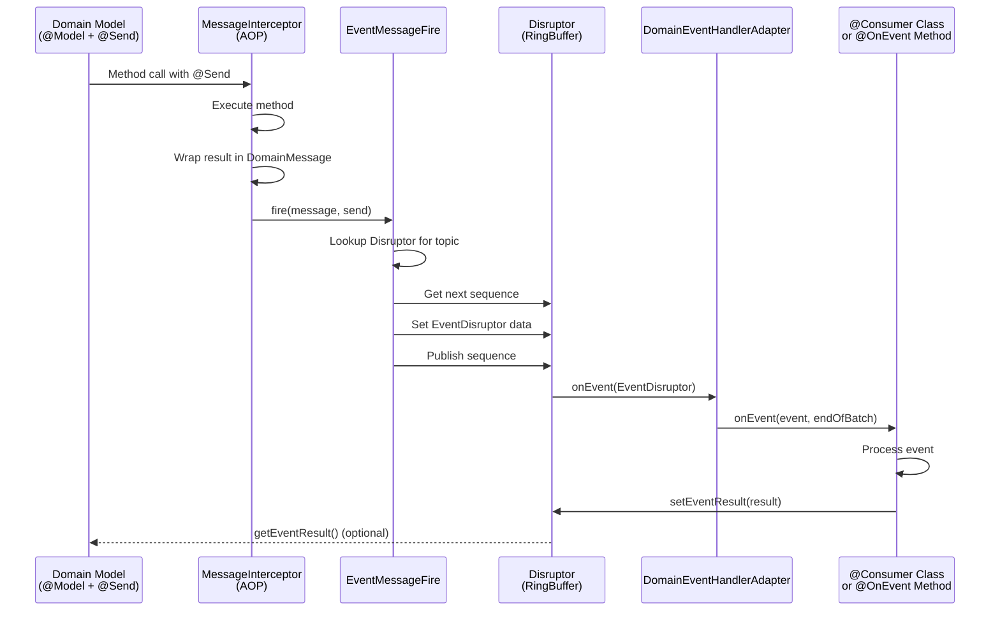
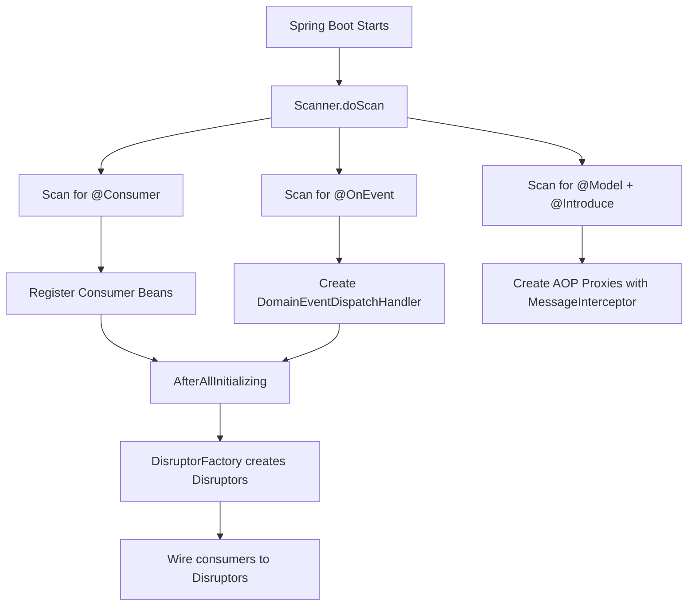
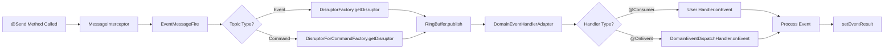

# Spring-Disruptor Integration Architecture

## Overview

This codebase integrates **Spring Framework** with **LMAX Disruptor** to create a high-performance, asynchronous message communication system within Spring applications. The Disruptor acts as the message queue, providing ultra-low latency inter-thread messaging.

## Big Picture

This is a **Domain-Driven Design (DDD) framework** that enables:
- **Asynchronous event-driven communication** between domain models
- **Topic-based publish-subscribe** messaging pattern
- **High-performance message processing** using Disruptor ring buffers
- **Annotation-driven configuration** similar to Spring's programming model

---

## Core Architecture Components

### 1. **Annotation Layer** - Define Messaging Contracts

#### Producer Annotations
- **`@Model`**: Marks a domain model class (lives in memory, not database)
- **`@Introduce("message")`**: Enables AOP interception on the model
- **`@Send("topicName")`**: Marks a method as a message producer
  - Returns a `DomainMessage` or any object (auto-wrapped)
  - Publishes to the specified topic

#### Consumer Annotations
- **`@Consumer("topicName")`**: Marks a class as a message consumer
  - Must implement `DomainEventHandler<EventDisruptor>`
  - Receives messages from the specified topic
- **`@OnEvent("topicName")`**: Marks a method as an event consumer
  - Alternative to implementing `DomainEventHandler`
  - Method receives the event source object as parameter

#### Command Pattern Annotations
- **`@OnCommand("topicName")`**: For command-style messaging to domain models
- **`@Receiver`**: Marks the target domain model parameter
- **`@Owner`**: Marks the owner parameter for disruptor pooling

---

### 2. **Spring Integration Layer** - Bootstrap & Scanning

#### `Scanner` (Container Bootstrap)
- **Purpose**: Scans classpath at Spring startup for custom annotations
- **Key Functions**:
  - Discovers all `@Consumer` classes and registers them
  - Discovers all `@OnEvent` methods and creates handlers
  - Discovers all `@Model` classes with `@Introduce`
  - Builds topic → consumer mappings
  - Stores metadata in Spring beans for runtime lookup

#### `AfterAllInitializing` (Post-Processing)
- Runs after all beans are initialized
- Creates Disruptor instances for each topic
- Wires up consumers to their respective Disruptors

---

### 3. **AOP Interception Layer** - Message Publishing

#### `MessageInterceptor`
- **Purpose**: Intercepts methods annotated with `@Send`
- **Flow**:
  1. Method executes normally
  2. Return value is captured
  3. Wrapped in `DomainMessage` (if not already)
  4. Delegates to `EventMessageFire` for publishing
- **Registered as**: Spring bean named `"message"` (referenced by `@Introduce("message")`)

---

### 4. **Message Publishing Layer** - Event Distribution

#### `EventMessageFire`
- **Purpose**: Central hub for publishing messages to Disruptor
- **Key Methods**:
  - `fire(DomainMessage, Send)`: Publishes to event consumers (`@Consumer` or `@OnEvent`)
  - `fireToModel(DomainMessage, Send, MethodInvocation)`: Publishes to model commands (`@OnCommand`)
  - `fire(DomainMessage, Send, FutureListener)`: Publishes with future-based async result handling

- **Publishing Flow**:
  1. Looks up the Disruptor for the topic
  2. Gets next sequence from RingBuffer
  3. Retrieves `EventDisruptor` object at that sequence
  4. Sets topic and `DomainMessage` on the event
  5. Publishes the sequence (consumers are notified)

---

### 5. **Disruptor Management Layer** - Ring Buffer Lifecycle

#### `DisruptorFactory`
- **Purpose**: Creates and manages Disruptor instances per topic
- **Key Features**:
  - **One Disruptor per topic** (lazy creation)
  - Maintains `ConcurrentHashMap<String, TreeSet<DomainEventHandler>>` mapping topics to handlers
  - Supports multiple consumers per topic (sorted by class name for deterministic ordering)
  - Configurable ring buffer size (default: 8)
  - Supports both multi-producer and single-producer modes

- **Wait Strategies**:
  - Uses `BlockingWaitStrategy` for single-producer scenarios
  - Balances CPU usage vs throughput

#### `DisruptorForCommandFactory`
- **Purpose**: Specialized factory for command-style messaging
- **Features**:
  - Supports `@OnCommand` pattern
  - Enables **single-threaded aggregate root modification** (DDD pattern)
  - Uses `@Receiver` to identify target model
  - Pools Disruptors per owner (for multi-tenancy or per-aggregate isolation)

#### `DisruptorPoolFactory`
- **Purpose**: Pools Disruptor instances for reuse
- **Benefits**: Reduces overhead of creating/destroying Disruptors

---

### 6. **Event Processing Layer** - Consumer Execution

#### `DomainEventHandler<T>` (Interface)
- **Purpose**: Contract for event consumers
- **Method**: `void onEvent(EventDisruptor event, boolean endOfBatch)`
- **Implemented by**:
  - User-defined `@Consumer` classes
  - `DomainEventDispatchHandler` (for `@OnEvent` methods)

#### `DomainEventHandlerAdapter`
- **Purpose**: Adapts `DomainEventHandler` to Disruptor's `EventHandler<EventDisruptor>`
- **Why needed**: Bridges custom interface to Disruptor's API
- **Flow**:
  1. Disruptor calls `onEvent(EventDisruptor, long, boolean)`
  2. Adapter calls `handler.onEvent(event, endOfBatch)`
  3. Catches and logs exceptions

#### `DomainEventDispatchHandler`
- **Purpose**: Generic handler for `@OnEvent` annotated methods
- **Flow**:
  1. Retrieves the consumer bean from Spring context
  2. Extracts event source from `DomainMessage`
  3. Matches parameters by type
  4. Invokes the method via reflection
  5. Sets result back to `DomainMessage` (for synchronous result retrieval)

---

### 7. **Message Data Layer** - Event Payload

#### `DomainMessage`
- **Purpose**: Carries event data between producer and consumer
- **Key Fields**:
  - `eventSource`: The actual event payload (any object)
  - `eventResultHandler`: For retrieving consumer's result
  - `eventResultCache`: Cached result (atomic reference)

- **Key Methods**:
  - `getEventResult()`: Non-blocking result retrieval (with timeout)
  - `getBlockEventResult()`: Blocking result retrieval
  - `setEventResult(Object)`: Consumer sets the result

#### `EventDisruptor`
- **Purpose**: The event object stored in Disruptor's RingBuffer
- **Fields**:
  - `topic`: Topic name
  - `domainMessage`: The actual message payload
- **Lifecycle**: Pre-allocated in ring buffer, reused for each event

#### `EventResultHandler` / `EventResultHandlerImp`
- **Purpose**: Handles async result retrieval from consumers
- **Implementation**: Uses internal RingBuffer for producer-consumer result passing
- **Supports**:
  - Timeout-based retrieval
  - Blocking retrieval
  - Non-blocking retrieval

---

## Message Flow Diagram



---

## Component Connections

### Startup Phase (Spring Container Initialization)



### Runtime Phase (Message Publishing & Consumption)



---

## Key Design Patterns

### 1. **Topic-Based Pub/Sub**
- **Pattern**: `@Send("topicA")` → `@Consumer("topicA")`
- **Benefits**: Decouples producers from consumers
- **Cardinality**: 1 producer → N consumers (fan-out)

### 2. **Adapter Pattern**
- **`DomainEventHandlerAdapter`**: Adapts custom handler interface to Disruptor's API
- **Benefits**: Isolates framework-specific code

### 3. **Factory Pattern**
- **`DisruptorFactory`**: Creates and caches Disruptor instances
- **Benefits**: Centralized lifecycle management

### 4. **Object Pool Pattern**
- **`DisruptorPoolFactory`**: Reuses Disruptor instances
- **Benefits**: Reduces GC pressure and initialization overhead

### 5. **Interceptor Pattern (AOP)**
- **`MessageInterceptor`**: Transparently intercepts `@Send` methods
- **Benefits**: Non-invasive messaging integration

### 6. **Command Pattern**
- **`@OnCommand` + `@Receiver`**: Encapsulates requests as objects
- **Benefits**: Single-threaded aggregate modification (DDD)

---

## Performance Characteristics

### Why Disruptor?
- **Lock-free**: Uses CAS operations instead of locks
- **Cache-friendly**: Ring buffer is pre-allocated array
- **Batching**: Consumers can process multiple events in batch
- **Low latency**: Microsecond-level latency (vs milliseconds for queues)

### Configuration Points
- **Ring Buffer Size**: Configurable via `DisruptorParams` (default: 8)
- **Wait Strategy**: `BlockingWaitStrategy` (low CPU, moderate latency)
- **Producer Type**: Single or multi-producer modes

---

## Example Usage

### Producer (Domain Model)
```java
@Model
@Introduce("message")
public class OrderService {
    
    @Send("orderCreated")
    public DomainMessage createOrder(Order order) {
        // Business logic
        return new DomainMessage(order);
    }
}
```

### Consumer (Event Handler)
```java
@Consumer("orderCreated")
public class OrderNotificationHandler implements DomainEventHandler<EventDisruptor> {
    
    @Override
    public void onEvent(EventDisruptor event, boolean endOfBatch) {
        Order order = (Order) event.getDomainMessage().getEventSource();
        // Send notification
        event.getDomainMessage().setEventResult("Notification sent");
    }
}
```

### Alternative Consumer (Method-based)
```java
@Component
public class OrderProcessor {
    
    @OnEvent("orderCreated")
    public String processOrder(Order order) {
        // Process order
        return "Order processed";
    }
}
```

---

## Summary

This framework provides a **Spring-native, annotation-driven, high-performance messaging system** using Disruptor as the underlying queue. It's designed for:

- **Domain-Driven Design**: Supports DDD patterns (aggregates, commands, events)
- **Asynchronous Processing**: Non-blocking event handling
- **High Throughput**: Leverages Disruptor's lock-free design
- **Spring Integration**: Seamless integration with Spring's DI and AOP
- **Flexible Consumption**: Supports both interface-based and method-based consumers

The architecture cleanly separates concerns across annotation, scanning, interception, publishing, queue management, and consumption layers.
